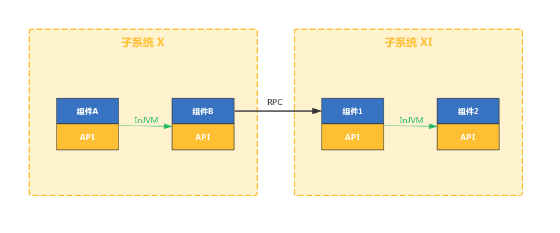
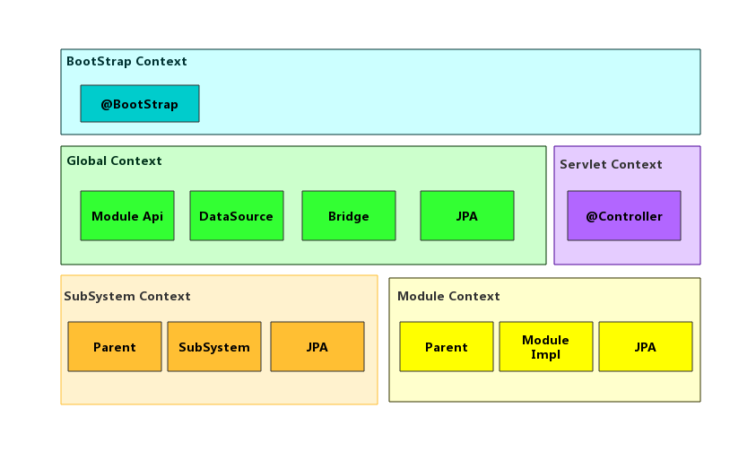
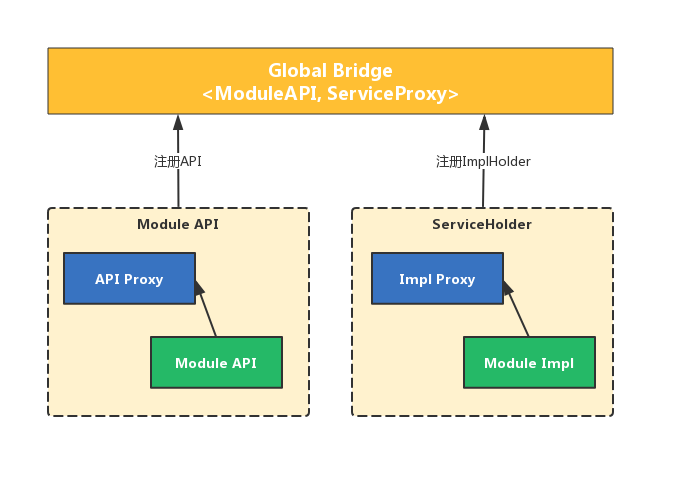
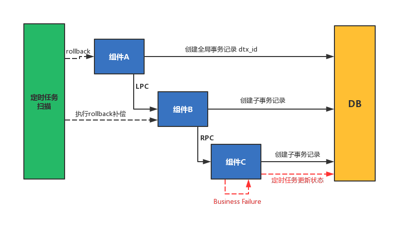

# 概览

**SkyEngine** 是基于**组件化思想**，通过制定一些约定规范、工具脚手架，以达到简化业务开发、统一代码风格、提高产品效能和质量的框架。通过使用 SkyEngine 你可以快速构建出业务组件，并可以将组件进行复用、整合成一个系统，最终部署运行系统。

## 1. 什么是组件化思想？

随着业务的发展，系统变得越来越庞大复杂，经常有某些已经实现的功能，在另一个项目中也需要使用到，这个时候通常使用引用该功能 `jar` 包的方式进行，但如果该功能未单独拆分出 `jar` 包时，一般通过复制一份实现来使用。这样的结果导致系统的依赖越来越庞杂、臃肿和难以维护。

组件化是将整个系统划分为若干关联的子系统，以及高内聚低耦合的小而美的模块与微服务，理清模块的职责、交互与边界。组件化是可灵活组合和可定制的前提，是构建大型软件应用的核心思想。

## 2. 组件化实现

SkyEngine 是基于 Spring 开发的一个框架，通过 **扩展 Spring** 和 **自定义类加载器** 达到多个组件之间的上下文隔离的目标。

- 开发阶段隔离：通过约定划分 **组件定义工程(def)** 和 **组件实现工程(impl)**，使用组件时仅能通过 `def` 工程。
- 运行阶段隔离：为每个组件定义自己的 **类加载器** 确保无法访问通过 **反射** 使用组件内部的类，为每个组件定义自己的 **Spring IOC容器** 确保无法通过 **Bean 注入** 的方式使用组件内部类。 

## 3. 组件间通信

通过将系统组件化后，必然会产生的问题 **组件间调用** 该怎么实现。SkyEngine 通过使用 **动态代理** 模式对组件进行包装后注入 Spring 容器，以对业务的 **无侵入方式** 实现，让你在业务开发过程中无需关心组件间的通信是如何完成。

组件的调用使用方式保持和使用 Spring 时一致，只需要使用 `@Autowired AdminServiceAPI service`  自动注入 `API` 接口即可，和使用本地的代码相同。

## 4. 数据持久化

SkyEngine 基于 **JPA** 进行了包装扩展，以方便业务开发使用为目标。并提供了关于本地事务、乐观锁、多数据源使用的简洁方式。目前 SkyEngine 跟据公司的技术沉淀仅提供了基于 JPA 的数据持久化方式，后续会根据业务需求进行扩展支持其他方式。

SkyEngine 把 JPA 上下文的初始化放在容器初始化阶段，业务开发使用仅需要将你的业务 `dao` 继承 `SkyEngineJpaRepository` 接口即可。如果需要用到多数据源，则可以使用注解 `@DataSource` 指定数据源。

## 5. 事务补偿

基于组件化思想将复杂的单体应用拆分为若干个功能简单、松耦合的组件后，这样可以降低开发难度、增强扩展性、便于敏捷开发。系统组件化后，一个看似简单的功能，内部可能需要调用多个组件才能完成，组件调用的 **分布式事务问题** 变得非常突出。

SkyEngine 中对此类近似分布式事务的问题进行了解决，设计了一套基于 **数据库存储** 的统一事务提交、回滚的机制。当一个组件被调用时，会产生一个 **全局事务** `dtx_id` 并记录到数据库，接下去的组件调用将作为此事务的 **子事务** 记录。

- 事务成功：更改全局事务状态标记为完成，子事务在执行的时候已经提交本地事务。
- 事务失败：通过 **定时任务** 对已执行的子事务进行补偿，执行对应的补偿方法 `rollbackFunction`。

SkyEngine 事务补偿的实现是根据当前的业务情况下定制的，后续还会根据具体的业务场景进行扩展和升级。

## 6. 总结

SkyEngine 是为了提高软件生产效能、提升软件质量和可维护性为目标的一个框架，后续的扩展和升级也是坚持这个原则：**简化开发、约定大于配置** 。本编文章是对 SkyEngine 主要涉及到的几个部分的简单介绍，详细每个模块的设计和实现可以查阅以下文档。

- [SkyEngine 约定与规范](约定与规范.md)
- [SkyEngine 原理与设计 ](TBD)