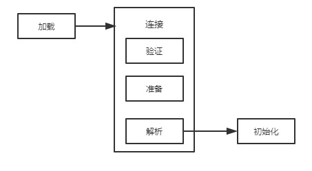

1. 在java代码中，类型的加载、连接与初始化的过程都在程序运行期间进行的

   

   - 加载：查找并加载类的二进制数据

   - 连接

     - 验证：确保被加载类的正确性

     - 准备：为类的**静态变量**分配内存，并将其初始化为**默认值**

       **例1-1：**

       ~~~java
       public class Test{
           private static int a = 1;
       }
       ~~~

       在此阶段a的值为默认值，即**a==0**

     - 解析：**把类中的符号引用转换为直接引用**

   - **初始化：把类的静态变量赋予正确的初始值**

     ​       在此阶段，例1-1中的a才被复制为1，即**a==1**

   ---

2. java虚拟机与程序的生命周期，在如下几种情况下将结束生命周期

   - 执行了System.exit()方法
   - 程序正常执行结束
   - 程序在执行过程中遇到了异常或者错误而异常终止
   - 由于操作系统出现错误而导致java虚拟机进程终止

   ----

3. java对类的使用方式为两种：

    - 主动使用
      - 创建类的实例
      - 访问一个类或者接口的静态变量，或对静态变量进行赋值
      - 调用类的静态方法
      - 反射（如：Class.ForName("com.test.Test")）
      - 初始化一个类的子类
      - 启动类
      - JDK1.7提供的对动态语言的支持（极少涉及）
    - 被动使用

    ---

4. 所有的虚拟机实现必须在每个类或接口被java程序 “**首次主动加载**”时才初始化他们，没有初始化，并不一定不会**加载与连接**

    ---

5. 加载.class文件的方式

    - 从本地直接加载
    - 从网络中下载.class文件
    - 从ZIP、jar等归档文件中加载
    - 从数据库中提取
    - **将java源文件动态编译为.class文件**

6. 虚拟机参数

    - -XX:+TraceClassLoading   用于类的加载信息并在控制台打印
    - 三种虚拟机参数说明：
      - -XX:+<Option>   :开启Option选项功能
      - -XX:-<Option>    :关闭Option选项功能
      - -XX:<Option>=<value>    :设置Option为value

7. 放大

8. 